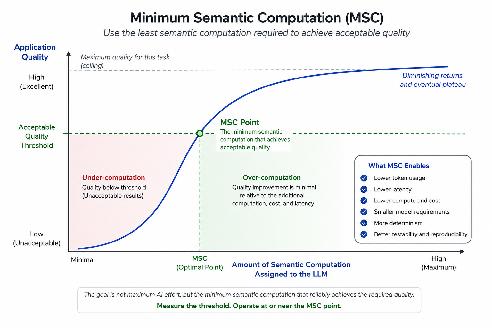
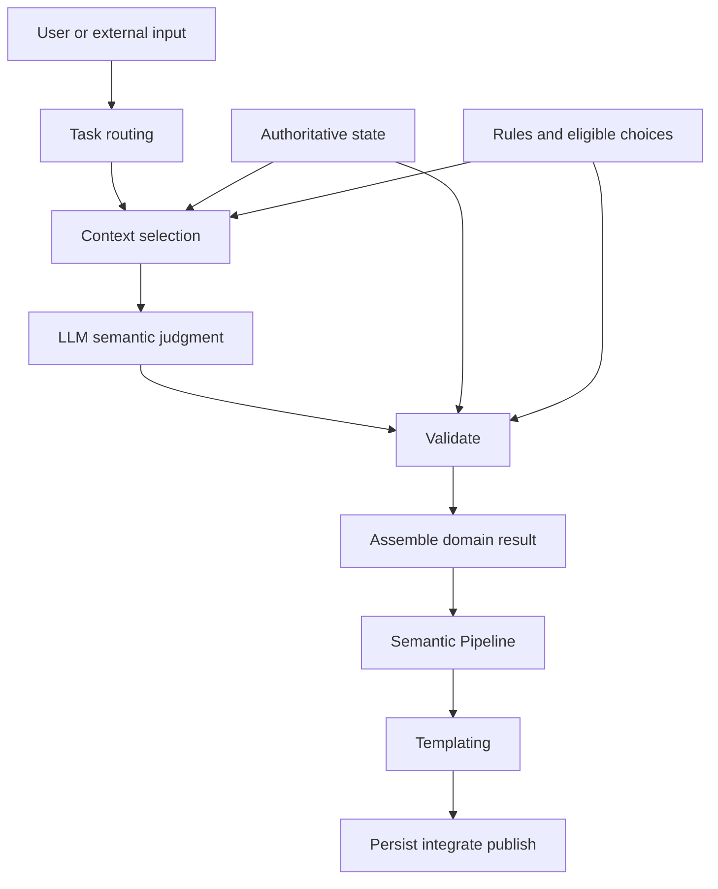
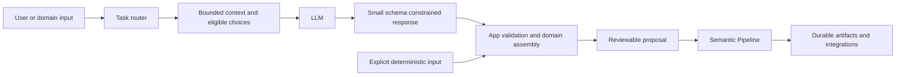
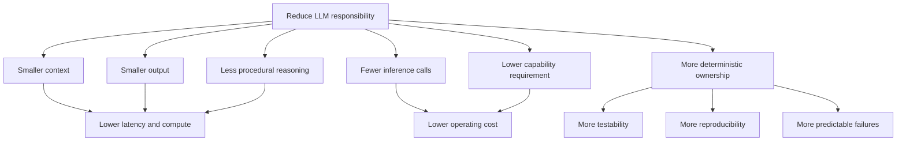
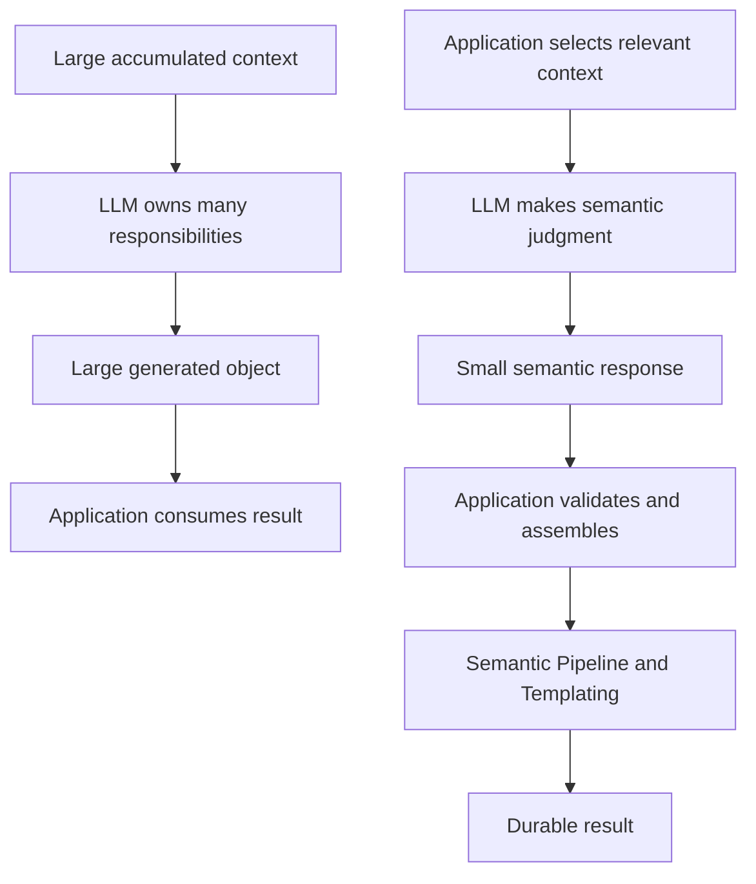
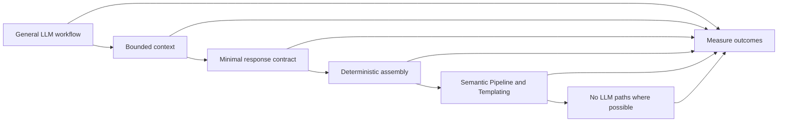
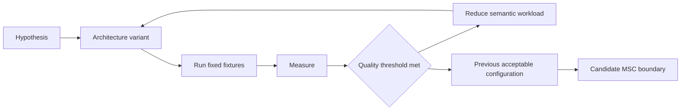

# LLM Improvement and Efficiency Through Deterministic Offload

## Executive summary

The objective of this approach is not merely to make individual LLM calls faster or cheaper. It is to explore application architectures that systematically reduce how much **model capability, context, generation, and reasoning** are required to solve a problem successfully.

The central strategy is to assign each kind of work to the part of the system best suited to perform it. Deterministic software selects relevant context, enforces rules, manages state, validates results, renders repeatable outputs, and performs mechanical transformations. The LLM is reserved for the smaller set of decisions that genuinely benefit from language understanding, ambiguity resolution, synthesis, or semantic reasoning.

> **LLMs should be semantic engines, not application engines.**

The governing rule is:

> **Ask the LLM for the smallest semantic decision that cannot be produced deterministically. Assemble, validate, render, and persist everything else in code.**

For a general audience:

> **Ask the AI to do less, so it can do the important part better.**

---

## Research hypothesis

> **As deterministic software takes responsibility for work that does not require semantic judgment, the amount of computation required from the LLM should decrease while overall system reliability and output quality remain constant or improve.**

| Expected reduction | Quality or control to preserve or improve |
| --- | --- |
| Input context and tokens | Relevance and grounding |
| Generated output and tokens | Acceptance without editing |
| Reasoning workload | Semantic decision quality |
| Number of inference calls | End-to-end task completion |
| Required model capability or size | Accuracy and usefulness |
| Inference latency | User-perceived responsiveness |
| Compute and operating expense | Reliability |
| Probabilistic application behavior | Determinism and reproducibility |

A particularly important proposition is that **architecture changes the minimum model capability required for a task**. A workflow that appears to require a large model when the model owns the entire process may be solvable by a substantially smaller model when context selection, state, validation, orchestration, and rendering are moved into deterministic software.

Model-size reduction should therefore be treated as an **experimental result**, not an assumption.

---

## Minimum Semantic Computation

For discussion purposes, this document refers to the target of this optimization as **Minimum Semantic Computation (MSC)**:

> **The minimum amount of probabilistic semantic computation required to produce an acceptable application result.**

MSC is not necessarily the smallest possible model or the fewest possible tokens. An optimization that reduces tokens but increases retries, manual correction, unsupported conclusions, or rejected results has not necessarily reduced the true cost of the task.

A more meaningful unit is often:

> **Compute, cost, or latency per accepted result, not merely per model call.**

The curve is conceptual rather than a claim that every model or task follows a smooth function. Real systems may contain capability thresholds and discontinuities. The MSC boundary should be determined empirically.

---

## Visual model of the approach

The architecture deliberately narrows the probabilistic portion of the system.

The important boundary is not between AI software and traditional software. It is between work that requires **probabilistic semantic judgment** and work that can be performed **deterministically**.

### Responsibility map

### System responsibilities

| Layer | Best suited for | Why |
| --- | --- | --- |
| **App / Domain API** | State, rules, validation, IDs, authoritative data, synchronous assembly | Exact, fast, testable |
| **Retrieval / semantic memory** | Selecting relevant knowledge for the current task | Prevents context accumulation |
| **LLM** | Interpretation, ambiguity resolution, synthesis, classification, bounded choice | Handles meaning and language |
| **Semantic Pipeline** | Multi-step orchestration, asynchronous work, semantic indexing, integration | Observable, reusable, composable |
| **Templating** | Rendering files, configuration, documents, payloads, prompts, previews | Repeatable and diffable |
| **Persistence / downstream systems** | Durable truth and execution | Keeps probabilistic output away from direct writes |

---

## Core architecture

The generic architecture uses four primary responsibilities:

- **App / Domain API** — synchronous validation, authoritative state, domain rules, deterministic assembly, and persistence boundaries.
- **Semantic Pipeline** — reusable orchestration for asynchronous, observable, multi-step semantic and deterministic work.
- **Templating** — deterministic rendering of validated data into repeatable artifacts.
- **LLM** — bounded interpretation, synthesis, ambiguity resolution, and semantic choice.

This separation makes model size and reasoning depth a **per-task engineering decision** rather than a property of the whole application.

### Execution boundary

The LLM is not the database, serializer, validator, workflow engine, build system, or source of domain truth. Its response is an advisory semantic input to a deterministic pipeline.

### Deterministic rendering with Templating

**Templating** owns repeatable rendering from validated structured data into source files, documents, configuration, prompts, previews, payloads, and other artifacts. The LLM can decide *what* should be produced; Templating determines *exactly how* approved data is rendered.

---

## How token demand is reduced

### 1. Task-specific prompts replace one universal prompt

Each major task should have a purpose-built input context, minimal response schema, bounded set of eligible choices, and task-specific output limit.

| Task | LLM receives | LLM returns | Example ceiling |
| --- | --- | --- | ---: |
| Discovery | Identity, accepted truths, recent relevant history, bounded memory | Reflection, next question, evidence-backed discoveries | 700 |
| Analysis | Relevant facts, constraints, recent history, bounded retrieval | Compact analysis discoveries | 1,200 |
| Selection | Current question and only eligible choices | Short explanation and selected ID | 180 |
| Domain classification | Current question, bounded state, allowed categories | Category and subject | 220 |
| Advanced synthesis | Accepted state, relevant retrieval, bounded candidates | Structured semantic proposal | 1,600 |
| General conversation | Latest message and bounded session history | One answer | 700 |
| Domain assistant | Domain identity, bounded history, authoritative excerpts | Answer and bounded structured statements | 1,000 |

The limits are ceilings, not expected consumption.

### 2. Context is selected instead of accumulated

The prompt should represent a **working set, not an archive**. Typical controls include:

- only recent turns relevant to the active task;
- only accepted facts relevant to the current question;
- a small number of semantic-memory matches;
- compact summaries instead of complete domain objects;
- only eligible catalog or configuration choices;
- only the most relevant retrieved source excerpts.

Durable state belongs outside the context window.

### 3. The model returns signals, not durable domain objects

The model should communicate the semantic decision. Deterministic code should resolve authoritative metadata, identifiers, compatibility, provenance, defaults, and persistence structures.

A small machine-readable response is usually safer than parsing prose. The optimization is not **no JSON**; it is **only the minimum JSON required to communicate the semantic result**.

### 4. Do not duplicate reasoning already performed by the application

If the application already knows the workflow state, current question, accepted facts, valid choices, compatibility rules, and output shape, the model should not be asked to reconstruct that procedural reasoning.

- **Procedural reasoning code can perform exactly** belongs in the application.
- **Semantic judgment requiring language understanding** belongs in the LLM.

### 5. Bypass the model when inference adds no value

Examples include explicit fact capture, normalization, duplicate filtering, validation, formatting known structured data, rendering templates, calculating hashes, and transforming one known schema into another.

The fastest and most reliable LLM call is often the one that never happens.

---

## Work removed from the LLM

| Mechanical task | Preferred owner |
| --- | --- |
| Durable domain-object assembly | App / Domain API |
| Schema enforcement | Provider plus App validation |
| Stable IDs and decision keys | App / Domain API |
| Duplicate removal | App / Domain API |
| Canonical values | App / Domain API |
| Citation and reference filtering | App / Domain API |
| Catalog metadata and compatibility | App / Domain API |
| Workflow progression | App / Semantic Pipeline |
| Explicit fact capture | App / Semantic Pipeline |
| Semantic-memory indexing | Semantic Pipeline |
| Artifact orchestration | Semantic Pipeline |
| Source and document rendering | Templating |
| Configuration generation | Templating |
| Artifact inventory and hashing | Semantic Pipeline |
| Integration request assembly | Semantic Pipeline |
| Revisions and persistence | App / Domain API |
| Provenance resolution | App / Domain API |

> If the application can calculate it, look it up, validate it, or render it exactly, the model should probably not invent it.

---

## Why quality can improve while token use falls

Reducing tokens is useful only if it preserves or improves quality.

1. **One semantic task at a time.** The model is not simultaneously interpreting input, inventing identifiers, normalizing data, deduplicating history, calculating compatibility, and formatting persistence objects.
2. **Authoritative evidence.** Model discoveries or recommendations can be required to reference evidence actually supplied to the model.
3. **Constrained choices.** If only five choices are valid, send those five choices.
4. **Deterministic rejection.** Invalid references, unknown IDs, duplicates, malformed responses, and impossible state transitions can be rejected before they enter durable state.
5. **Stable application semantics.** Canonical facts, IDs, provenance, compatibility, revisions, and workflow progression should not vary with model wording or temperature.
6. **Review remains the write boundary.** A successful model response can create a proposal without directly changing authoritative state.

---

## Architectural effect of reducing LLM responsibility

### Conventional versus bounded semantic architecture

The bounded architecture reduces the **probabilistic surface area** without assuming that the model itself is less capable.

---

## Evidence from a working implementation

This architecture has been applied successfully in a real application implementation. The implementation itself is private, but its observed behavior provides practical evidence that the research direction is viable.

In that implementation, a local **8B model** became practical for interactive use after semantic responsibilities were narrowed and deterministic responsibilities were moved into application code and reusable pipeline operations. Developer-observed reasoning turns improved from **more than 2.5 minutes to approximately 35–40 seconds** while producing more focused proposals.

Using 150 seconds as a conservative baseline, this represents an observed wall-clock improvement of approximately **3.75–4.29x**, or a **73–77% reduction**.

These observations are not presented as a universal benchmark. They are an implementation result that motivates controlled experimentation.

The implementation details can remain proprietary while the architectural hypothesis, measurement methodology, and aggregate results remain independently discussable and reproducible in other domains.

---

## Experimental model

The research can be evaluated by progressively reducing the amount of responsibility assigned to the model while measuring whether application quality is preserved.

### Measurement loop

This turns model selection and prompt sizing into an engineering qualification process rather than an intuition-driven choice.

---

## Performance measurement contract

A controlled comparison should record:

- application version or commit;
- task and prompt-contract version;
- model name and quantization;
- inference runtime and host hardware;
- cold or warm model state;
- context window and accelerator residency;
- concurrent load;
- exact input and output tokens;
- time to first token;
- generation rate;
- total response duration;
- schema-valid-on-first-attempt rate;
- timeout and truncation rate;
- acceptance without editing;
- grounding and invalid-reference rates;
- duplicate and invalid-selection rates.

At minimum, run each fixture once cold and multiple times warm. Report median and p95 warm duration separately from cold-start duration.

Token counts should come from the inference provider's usage metadata or exact tokenizer. Character counts and schema byte sizes are useful structural measurements but must not be reported as token counts.

### Suggested benchmark variants

1. **General prompt and general schema**
2. **Task-specific prompt and minimal schema**
3. **Task-specific LLM plus deterministic assembly**
4. **Task-specific LLM plus Semantic Pipeline and Templating**
5. **No-LLM deterministic path** where inference adds no value

A faster or smaller model is qualified only when it also satisfies defined quality, grounding, reliability, and acceptance thresholds.

---

## Presentation summary

**Design objective:** keep the **THINK** stage as small as practical while preserving the quality of the complete **KNOW → THINK → VERIFY → DO** system.

---

## Conclusion

The objective of this architecture is not to minimize AI usage for its own sake. It is to **maximize the value of every inference**.

Semantic interpretation, ambiguity resolution, synthesis, and reasoning remain with the LLM where they provide an advantage. Deterministic operations remain with software where they are faster, cheaper, exact, testable, and reproducible. The Semantic Pipeline coordinates reusable work, while Templating converts validated structured data into repeatable artifacts.

The key research question is not:

> How large a model can the application use?

It is:

> **How little probabilistic semantic computation does the application actually need?**

A successful architecture should demonstrate that reducing LLM responsibility reduces time, compute, expense, and model requirements **without transferring those savings into lower-quality outcomes or greater human correction**.

> **Use AI where meaning must be understood. Use deterministic software everywhere meaning has already been decided.**
